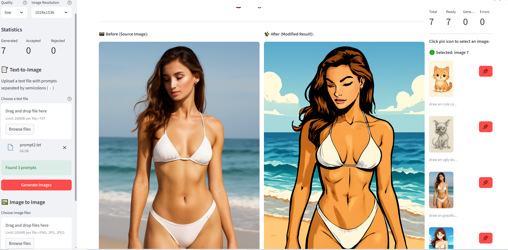
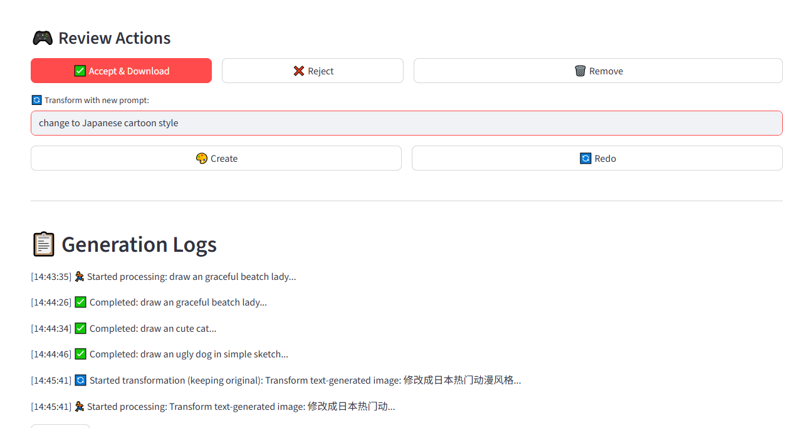
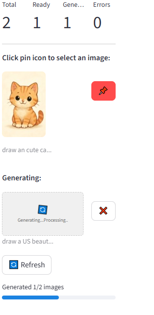

# AIandMan 🎨
**AI-Powered Image Generation with Human Touch**

Transform your creative ideas into stunning images with AIandMan - where AI meets human creativity. Powered by GPT-Image-1, this tool makes AI image generation and modification intuitive and efficient.


*AI Image Generation at Your Fingertips*

## ✨ Key Features

- 🚀 **Batch Processing**: Generate multiple images from text prompts simultaneously
- 🖼️ **Image Transformation**: Enhance and modify existing images with AI
- 👁️ **Human-in-the-Loop**: Review, accept, or modify AI-generated images
- ⚡ **Real-time Processing**: See your creations come to life instantly
- 📊 **Smart Queue Management**: Handle multiple generations efficiently

## 🎯 Perfect For

- Digital Artists seeking AI assistance
- Content Creators needing batch image generation
- Projects requiring controlled AI image output
- Teams wanting human oversight in AI generation

### Screenshot Tour


*Image review interface with before/after comparison*


*Batch processing interface showing multiple images in queue*


## Workflow

1. **Input**: Upload text file with prompts or image files
2. **Processing**: AI generates/transforms images in parallel
3. **Review**: Sequential presentation of generated images
4. **Decision**: Accept, reject, or request transformations for each image
5. **Output**: Approved images saved to user-configured directory

## 🛠️ Quick Setup

1. **Requirements**
   - Python 3.12+
   - Azure OpenAI GPT-Image-1 apikey
   - Streamlit

## 🔒 Setup & Authentication

### Password Protection
AIandMan includes a simple password authentication system to protect access:

- **Default Password**: `aiandman2025`
- **Custom Password**: Set `APP_PASSWORD` in your `.env` file

### Configuration
1. Copy `.env.example` to `.env`
2. Configure your Azure OpenAI credentials
3. (Optional) Set a custom password with `APP_PASSWORD`

### How to setup python environment
1. Create and activate a virtual environment (recommended):
```bash
python -m venv venv
.\venv\Scripts\activate  # Windows
source venv/bin/activate  # Linux/Mac
```

2. Install required packages:
```bash
pip install -r requirements.txt
```

### First Launch
To start the application, run:
```bash
streamlit run app.py --server.port 8503
```
Then open your web browser and navigate to `http://localhost:8503`. You'll be prompted to enter the password before accessing the main interface. The logout button is available in the sidebar once authenticated.


### 🎨 How to Use

#### Text to Images (Batch Generation)
Create a text file (e.g., `prompts.txt`) with prompts separated by semicolons:
```
a magical forest at sunset; cyberpunk city street at night; abstract art with vibrant colors....
```
Upload this file to generate multiple images at once.

#### Image Processing
- Load your reference images from local folders
- Apply transformations with a same custom prompt for all images
  ```
  Example: "Convert to anime style with vibrant colors"
  ```
- Review, accept, or modify results as needed